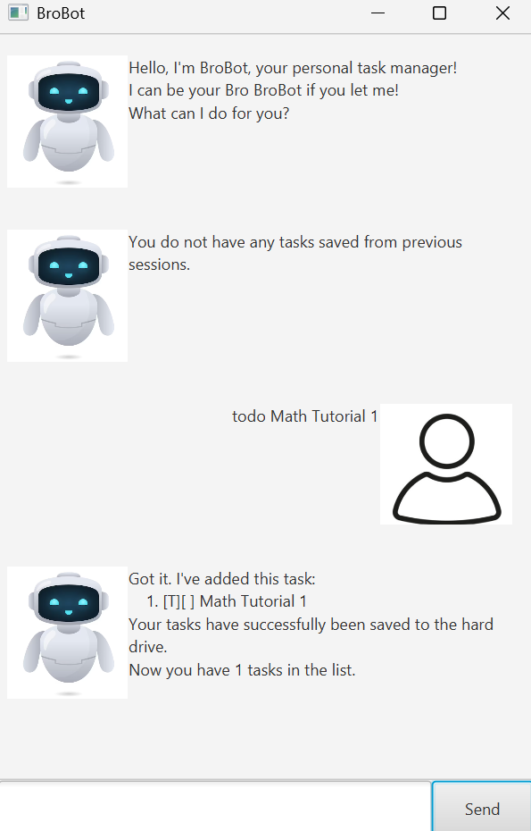

# BroBot User Guide



BroBot is a task manager app for those who prefer typing and do not like digging through deep menus.

## Adding Tasks

### Adding ToDo Tasks
Adds a simple named task to the tasklist.

Format: todo TASK_NAME

Example: `todo CS1234 Lab 1`

```
Got it. I've added this task:
    1. [T][ ] CS1234 Lab 1
Your tasks have successfully been saved to the hard drive.
Now you have 1 tasks in the list.
```

### Adding Deadline Tasks
Adds a task that must be done by a certain date.

Format:
deadline TASK_NAME by DEADLINE_DATE

Example (3-letter month): `deadline CS Project by 18 Oct 2025`
```
Got it. I've added this task:
    2. [D][ ] CS Project (by: 18 Oct 2025)
Your tasks have successfully been saved to the hard drive.
Now you have 2 tasks in the list.
```
Example (Full-name month): `deadline CS Project by 18 October 2025`
```
Got it. I've added this task:
    3. [D][] CS Project (by: 18 Oct 2025)
Your tasks have been successfully saved to the hard drive.
Now you have 3 tasks in the list. 
```

### Adding Event Tasks
Adds a task that starts at a certain date and ends at a certain date.

Format: event EVENT_NAME from START_DATE to END_DATE

Note that for dates in BroBot, users may input 3-letter months or full-name months, just like for Deadline Tasks. 

However, all dates will be displayed to the user by BroBot in 3-letter month format, just like for Deadline Tasks.

See the example below for clarification.

Example: `event project meeting from 17 November 2025 to 24 Nov 2025`

```
Got it. I've added this task:
    4. [E][ ] project meeting (from: 17 Nove 2025 to: 24 Nov 2025)
Your tasks have successfully been saved to the hard drive.
Now you have 4 tasks in the list.
```

## Deleting tasks
Deletes selected tasks by position. Note that this works like a command line form of the "select items" menu in GUI apps.

Note that all indices and positions in BroBot are 1-indexed for ease of use.

Example command formats:

1. delete

    No tasks are deleted.
    ```
    Noted. I've removed these tasks:
    Your tasks have successfully been saved to the hard drive.
    Now you have 4 tasks in the list.
    ```
   
2. delete TASK_INDEX_1 TASK_INDEX_2 ... TASK_INDEX_N
    
    Deletes the tasks with the selected indices in the input (1-indexed).

    For example, "delete 1 2 4" deletes the 1st, 2nd and 4th tasks
    ```
    4. [E][ ] Project Meeting (from: 17 Nov 2025 to: 24 Nov 2025)
    2. [D][ ] CS Project (by: 18 Oct 2025)
    1. [T][ ] CS1234 Lab 1
    Your tasks have successfully been saved to the hard drive.
    Now you have 1 tasks in the list.
    ```

3. delete all

    Deletes ALL the tasks in the list.
    ```
    Noted. I've removed these tasks:
    3. [T][ ] math homework
    2. [T][ ] science homework
    1. [D][ ] CS Project (by: 18 Oct 2025)
    Your tasks have successfully been saved to the hard drive.
    Now you have 0 tasks in the list.
    ```